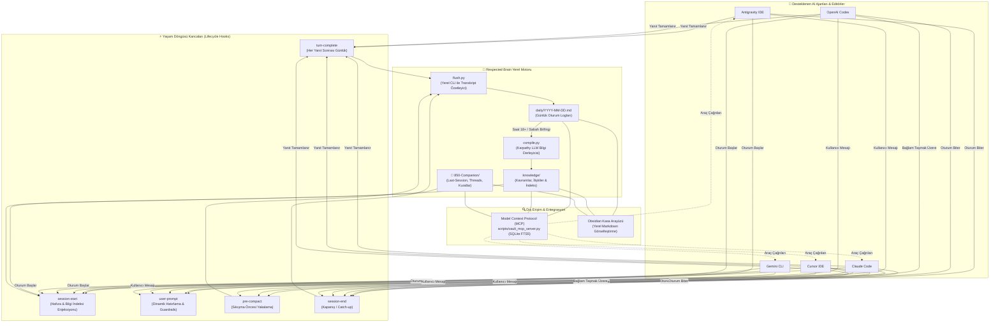
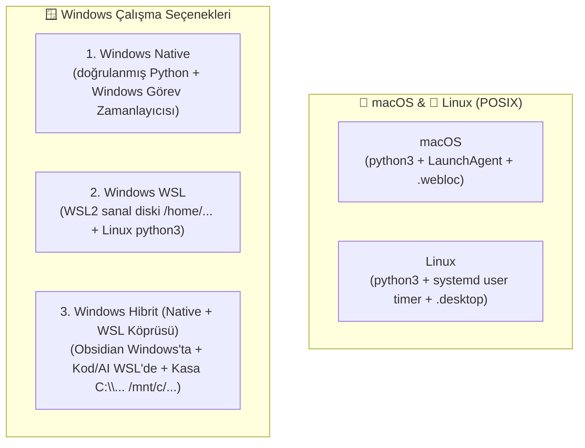
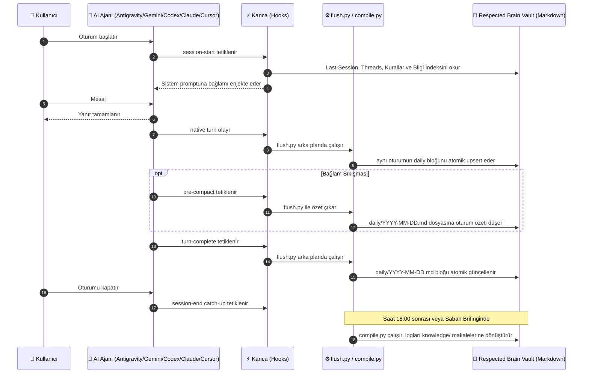
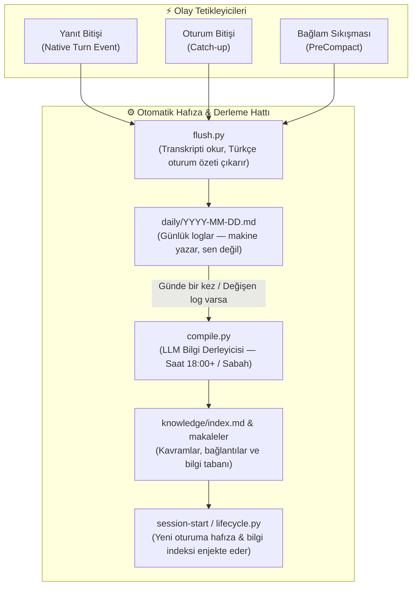

<div align="center">

# 🧠 Respected Brain
### Araç bağımsız, hatırlamayı unutmayan yerel kişisel ikinci beyin

<p align="center">
  <a href="https://github.com/respected0/respectedbrain/releases"></a>
  <a href="LICENSE"></a>
  
  
  
  
  
</p>

</div>

[Obsidian](https://obsidian.md) ile Claude Code, Codex, Cursor, Antigravity ve Gemini CLI üstünde çalışan,
açık kaynak bir **ikinci beyin**. Yerel bir Markdown vault, kalıcı hafıza, sıfır bağımlılık,
sıfır ekstra ücret. Dosya yönetmezsin, konuşursun.

Respected Brain'in temel farkı araç bağımsızlığıdır: ortak talimatlar `.beyin/instructions.md` içinde,
skill'ler `.beyin/skills/` altında tek kez tutulur; `CLAUDE.md`, `AGENTS.md`, Cursor rules ve
Antigravity rules/hook dosyaları buradan üretilir. Ayrıntılar için [MULTI_AI.md](MULTI_AI.md)
dosyasına bak.

Vault'un adı kullanıcıya aittir; `respectedOS` veya başka sabit bir ad zorunlu değildir. İsteğe bağlı
global kurulum, seçilen vault'u Claude, Codex, Cursor, Antigravity ve Gemini'ye kullanıcı düzeyinde
bağlayarak başka kod repolarında da aynı merkezi hafızayı kullanır.

## Kısaca nasıl çalışır?

Respected bir sohbet uygulaması veya yeni bir model değildir. Agentların arasında duran ortak,
dosya tabanlı hafıza katmanıdır:



Bir projeye Antigravity ile başlayıp ertesi gün Codex'e geçebilirsin. Codex, Antigravity'nin özel
sohbet ekranını veya bütün ham geçmişini devralmaz; bunun yerine ortak vault'taki son oturum,
aktif konular, kararlar, kurallar, günlük özetleri ve bilgi indeksini alır. Araç değiştirirken
taşınabilir olan şey **iş bağlamıdır**, sağlayıcının kendi sohbet arayüzü değildir.

**Respected Brain'in temel tezi şudur: hafıza rica değil, mekanizmadır.** Bir yapay zekanın
hafıza dosyalarını güncellemeyi hatırlamasını beklemek kırılgandır. Respected Brain'de desteklenen
ajanın her tamamlanan yanıtı native turn hook'u ile yakalanır ve aynı oturumun `daily/` bloğu arka
planda atomik olarak güncellenir; kapanış ve pre-compact olayları catch-up güvenlik ağıdır. Derleyici logları
`knowledge/` altında birbirine bağlanan makalelere dönüştürür. Ertesi sabah bu bilgi tabanının
indeksi kendiliğinden bağlama girer. Kimsenin bir şey yazmayı hatırlaması gerekmez.

Video izlemene gerek yok. Kurulum ve günlük kullanım bu README'de; ayrıntılı davranış ve bakım
notları [MULTI_AI.md](MULTI_AI.md), coding agentın uygulayacağı kurulum runbook'u [SETUP.md](SETUP.md)
içindedir.

---

## Hızlı Başlangıç: 3 Farklı Kurulum Seçeneği

Respected Brain'i ihtiyacınıza ve alışkanlığınıza en uygun kanaldan saniyeler içinde kurabilirsiniz:

### 1. AI-Native Kurulum (Önerilen — Tek Satır Prompt)

Tercih ettiğiniz kodlama asistanına (**Claude Code, Cursor Agent, Codex, Antigravity, Windsurf**) aşağıdaki tek satırlık komutu vermeniz yeterlidir:

```text
https://raw.githubusercontent.com/respected0/respectedbrain/main/BOOTSTRAP.md dosyasını oku ve yönergelerine göre bu dizinde Respected Brain kasasını kur. Kuruluma başlamadan önce benden kullanıcı adımı, kasa adımı, çalışma ortamımı (Native/WSL/Hibrit) ve model fallback sıramı al. Bitince kurduğun tüm bileşenleri listele.
```

Asistanınız `BOOTSTRAP.md` protokolünü okur; size adınızı, kasanızın kurulacağı yeri, düşünme ortağınızın adını ve model sıralamanızı sorarak kurulumu tamamlar.

---

### 2. Tek Satır (One-Liner) Kurulum

Terminalden tek bir komutla interaktif kurulum sihirbazını başlatın:

* **Windows (PowerShell):**
  ```powershell
  irm https://raw.githubusercontent.com/respected0/respectedbrain/main/install.ps1 | iex
  ```
* **Linux / macOS / WSL (Bash):**
  ```bash
  curl -sSL https://raw.githubusercontent.com/respected0/respectedbrain/main/install.sh | bash
  ```

*(Sisteminizde Python veya Git yüklü değilse, sihirbaz sizi uyarır ve tek tıkla yüklemeyi teklif eder).*

---

### 3. İnteraktif CLI Kurulum Sihirbazı

Repoyu yerel makinenize klonlayıp renkli terminal sihirbazıyla kurmak isterseniz:

```bash
git clone https://github.com/respected0/respectedbrain.git
cd respectedbrain
python install.py
```

Sihirbaz; algılanan AI modellerini listeler, model öncelik sırasını, çalışma ortamınızı (Windows Native, WSL veya Hibrit), masaüstü Obsidian açılış kısayolunu ve sabah brifingi saatini yapılandırır.

---

## 💻 Desteklenen Çalışma Ortamları: macOS, Linux, Windows Native, WSL ve Hibrit

Respected Brain, kişisel çalışma alışkanlıklarınıza ve işletim sisteminize göre 5 farklı çalışma ortamını birinci sınıf vatandaş olarak destekler:



| Çalışma Ortamı | Kasa Nerede Yaşar? | Obsidian Arayüzü | Python & Runtime | Görev Zamanlayıcı | Öne Çıkan Özellik / Kullanım Senaryosu |
| :--- | :--- | :--- | :--- | :--- | :--- |
| **macOS** | `$HOME/Documents/<kasa>` | Yerel macOS Obsidian | `python3` (Sistem/Brew) | `launchd` (LaunchAgents) | Yerel `.webloc` başlatıcı |
| **Linux** | `$HOME/Documents/<kasa>` | Yerel Linux Obsidian | `python3` (Sistem) | `systemd --user` / `cron` | Saf Linux dağıtımları, XDG `.desktop` menü kısayolu |
| **Windows Native** | `C:\Users\<ad>\Documents\<kasa>` | Yerel Windows Obsidian | Kurulumda doğrulanan mutlak Python 3 executable | Windows Görev Zamanlayıcısı | WSL kurmak istemeyen, her işini doğrudan Windows'ta yapanlar |
| **Windows WSL** | `/home/<user>/<kasa>` | WSLg veya terminal | `python3` (Linux/WSL) | Linux `systemd` / `cron` | Tüm geliştirme ortamı ve projeleri WSL2 sanal diskinde olanlar |
| **Windows Hibrit (Native + WSL)** | **Windows diskinde**<br/>(`C:\Users\<ad>\...` ↔ `/mnt/c/...`) | **Yerel Windows Obsidian**<br/>(Maksimum GUI hızı) | **WSL ve/veya Windows Python**<br/>(`runtime_platform` köprüsü) | Windows Task Scheduler / WSL | **En güçlü köprü modu:** Kasa Windows belgelerinde, Obsidian Windows'ta pürüzsüz çalışır; projeler ve AI CLI araçları ise WSL2 Linux terminalinde koşturulur. |

---

## 3 Farklı Yoldan Güncelleme (Update)

Mevcut bir kasanızı en güncel kararlı sürüme (`0.0.1`) yükseltmek için 3 pratik yol vardır (kişisel notlarınız ve kimlik dosyalarınız asla silinmez):

1. **AI-Native Güncelleme:** Ajanınıza doğrudan söyleyin:
   > *"Kasamı en son kararlı Respected Brain sürümüne güncelle."* (Ayrıntılar: [UPDATE.md](UPDATE.md))
2. **Tek Satır (One-Liner) Güncelleme:**
   - **Windows:** `irm https://raw.githubusercontent.com/respected0/respectedbrain/main/update.ps1 | iex`
   - **Linux / macOS:** `curl -fsSL https://raw.githubusercontent.com/respected0/respectedbrain/main/update.sh | bash`
3. **CLI Terminal:** `python update.py` (veya `python update.py --vault-path "/kasa/yolu" --apply`)

---

## Temiz Kaldırma (Uninstall)

Sistem entegrasyonlarını (global AI kancaları, zamanlanmış sabah brifingi görevi, kısayollar ve MCP sunucusu) temizlemek için:

- **Tek Satır (One-Liner):**
  - **Windows:** `irm https://raw.githubusercontent.com/respected0/respectedbrain/main/uninstall.ps1 | iex`
  - **Linux / macOS:** `curl -fsSL https://raw.githubusercontent.com/respected0/respectedbrain/main/uninstall.sh | bash`
- **CLI Terminal:** `python uninstall.py`

*(Varsayılan olarak ikinci beyin kasanız ve notlarınız kesinlikle silinmez, güvendedir. Ayrıntılar: [UNINSTALL.md](UNINSTALL.md)).*

---

### Kurulumdan Sonra: Obsidian ile Açın ve Başlayın

Global bağlantıyı seçtiysen vault klasöründe çalışmak zorunda değilsin. Herhangi bir kod reposunu
desteklenen agentlardan biriyle aç; ilk oturumda ortak hafıza bağlama girer, her tamamlanan yanıttan sonra özet merkezi
vault'a yazılır. Codex yeni global hook'u ilk kez gördüğünde `/hooks` ekranından bir defalık güven
isteyebilir.

### Agent kullanmadan elle global kurulum

Kurulum agentı olmadan da aynı işlemi yapabilirsin. Komut ilk çalıştırmada yalnız önizleme
gösterir; dosya yazmak için sonucu kontrol edip `--apply` ekle.

Windows + WSL örneği:

```bash
python3 scripts/install_global.py "/mnt/c/Users/KULLANICI/Documents/BenimBeynim" \
  --home "/mnt/c/Users/KULLANICI" \
  --antigravity-home "/home/WSL_KULLANICISI" \
  --platform windows-wsl --providers all

# Önizleme doğruysa:
python3 scripts/install_global.py "/mnt/c/Users/KULLANICI/Documents/BenimBeynim" \
  --home "/mnt/c/Users/KULLANICI" \
  --antigravity-home "/home/WSL_KULLANICISI" \
  --platform windows-wsl --providers all --apply
```

`windows-wsl` profilinde Codex'in aktif ortak skill kopyaları çalışan WSL kullanıcısının
`~/.agents/skills/` dizinine de senkronlanır. Kurulumdan sonra Codex Desktop'ta
**Ayarlar > Hooks** bölümünden yeni veya değişmiş hook'lara güven; CLI kullanıyorsan aynı işlem
`/hooks` ekranındadır.

Native Windows PowerShell örneği:

```powershell
py -3 scripts/install_global.py `
  "C:\Users\KULLANICI\Documents\BenimBeynim" `
  --home "C:\Users\KULLANICI" `
  --platform windows-native `
  --providers codex,cursor
```

macOS/Linux örneği:

```bash
python3 scripts/install_global.py "/mutlak/yol/BenimBeynim" \
  --home "$HOME" --platform portable --providers all
```

`--providers all` yerine yalnız kullandığın araçları virgülle yazabilirsin. Kurucu mevcut global
kurallarını silmez; yönetilen Respected bölümünü birleştirir ve değişecek dosyaları yedekler. Vault'un
adı serbesttir.

Antigravity IDE'yi hem Windows'ta hem **Connect to WSL** ile kullanıyorsan ek Linux profilini
`--antigravity-home` ile açıkça ver. Seçenek tekrarlanabilir; ek köklere yalnız `.gemini`
entegrasyonu kurulur, Codex/Cursor/Claude ana `--home` altında kalır. Connect to WSL kullanmıyorsan
bu seçeneği yazma.

## Dış Projelerden ve Editörlerden Erişim: Model Context Protocol (MCP)

Respected Brain, harici kod projelerinde çalışırken veya masaüstü AI editörlerini kullanırken kasanızdaki kalıcı hafızaya, kararlara ve bilgi tabanına anında erişebilmeniz için saf Python + SQLite FTS5 destekli yerel bir **Model Context Protocol (MCP)** sunucusu içerir.

### Editörlere Tek Komutla Kayıt

Aşağıdaki komutla Claude Desktop, Cursor, Antigravity IDE, Claude Code veya Windsurf editörlerine Respected Brain MCP sunucusunu otomatik olarak tanımlayabilirsiniz:

```bash
python3 scripts/vault_mcp_server.py --vault "/mutlak/vault/yolu" --register
```

Windows Native ortamında:
```powershell
py -3 scripts/vault_mcp_server.py --vault "C:\Users\KULLANICI\Documents\RespectedOS" --register
```

### Sağlanan MCP Araçları (Tools)

| Araç | Açıklama |
| :--- | :--- |
| `respected_search` | Vault içinde SQLite FTS5 tabanlı ultra hızlı anahtar kelime araması. |
| `respected_get_note` | Belirli bir not veya dokümanın tam içeriğini okur. |
| `respected_get_decisions` | Kasa genelinde alınan geçmiş mimari ve teknik kararları listeler. |
| `respected_get_companion_context` | Son oturum özeti (`Last-Session`), aktif konular (`Threads`) ve kuralları çeker. |
| `respected_quick_capture` | Dış projedeyken kasa `📥 000-Inbox/Dump/` klasörüne anında ham not düşer. |
| `respected_remember` | Önemli bir kural veya kararı doğrudan ortağın hafızasına kalıcı olarak işler. |
| `respected_expand` | Bir kavramın bilgi tabanındaki bağlantılı kavram ağını genişletir. |

## Agent değiştirmek

Ekstra taşıma komutu yoktur:

1. İlk agentın oturumunu normal biçimde bitir ve günlük özetin yazılması için birkaç saniye ver.
2. Aynı veya başka projeyi diğer agentta aç.
3. Yeni agent global/project hook üzerinden aynı vault bağlamını alır.

Örnek: Antigravity'de alınan karar tamamlanan yanıttan sonra `daily/` dosyasındaki oturum bloğuna
atomik olarak işlenir; Codex açıldığında son oturum ve bilgi indeksi bağlama eklenir. Session-end ve
pre-compact olayları kaçırılan turnler için catch-up güvenlik ağıdır.

## Beyin yol haritası ve sabah brifingi

Her oturum başlangıcında model çağırmayan harita üreticisi
`🎯 100-Command-Center/Vault-Map.md` ve `Skills-Map.md` dosyalarını yeniler. `Core.md` insan
tarafından yönetilmeye devam eder. Haritalar yalnız yapı ve kanonik `.beyin/skills/` metadata'sını
kullanır; agentın bütün vault'u taramasına gerek bırakmaz.

Sabah brifingi onayla kurulan platform zamanlayıcısı tarafından yerel saat 08.00'de hazırlanır.
Kaçırılan görev Windows'ta `StartWhenAvailable`, Linux'ta persistent timer ve macOS'ta login
catch-up ile yeniden denenir. Başarılı çıktı günde bir kez
`🎯 100-Command-Center/Briefings/YYYY-MM-DD.md` yoluna yazılır ve gerçek hazırlanma saatini taşır.
Model seçimi sabit değildir; normal provider fallback zinciri kullanılır.

Kurulum önce yalnız önizleme gösterir:

```bash
python3 scripts/install_briefing_schedule.py "/mutlak/vault/yolu" \
  --home "$HOME" --platform linux
# Kontrol ettikten sonra aynı komuta --apply ekle.
```

Önizleme tam zamanlayıcı tanımını, çalışacak komutu ve hedef dosyaları gösterir. `--apply` mevcut
yönetilen tanımı değiştiriyorsa kullanıcı dizininde `.respected/schedule-backups/` altına yedek alır;
aktivasyon başarısız olursa eski tanımı geri yükler. Var olan kullanıcı yazımı `Vault-Map.md` veya
`Skills-Map.md` otomatik olarak ezilmez.

## Özetlemeyi hangi AI yapar, limit biterse ne olur?

Varsayılan `auto` modudur ve çoğu kullanıcı bunu değiştirmemelidir:

1. Oturum hangi agenttan geldiyse önce onun CLI'ı denenir.
2. CLI kurulu değilse sıradaki kurulu sağlayıcı denenir.
3. Kota/rate-limit, timeout, geçici kapasite veya 5xx hatasında otomatik fallback yapılır.
4. Kimlik doğrulama veya bozuk yapılandırma gibi kalıcı hata gizlenmez; düzeltilmesi için raporlanır.

Örnek: Codex oturumunun kapanışında Codex limiti bittiyse ve Claude veya `agy` kurulu ve giriş
yapılmışsa özet onlardan biriyle tamamlanabilir. Fallback yalnız makinede kurulu ve oturum açılmış
CLI'lar arasında çalışır.

İsteyen kullanıcı özetleyicinin ilk tercihini vault içinde kalıcı olarak değiştirebilir:

```bash
python3 scripts/set_summary_provider.py auto          # önerilen
python3 scripts/set_summary_provider.py claude
python3 scripts/set_summary_provider.py codex
python3 scripts/set_summary_provider.py antigravity
python3 scripts/set_summary_provider.py gemini
python3 scripts/set_summary_provider.py cursor
```

Bu seçim kod yazdığın ana agentı değiştirmez; yalnız kapanış özeti ve bilgi derlemesinde önce hangi
yerel CLI'ın çağrılacağını belirler. Seçilen sağlayıcı geçici olarak kullanılamazsa fallback devam eder.

### 0.0.1 Öncesi Sürümlerden Güncelleme

Daha önceki (0.0.1 öncesi erken sürümlerden) bir Respected Brain kasanız varsa, repo kökünden doğrudan `scripts/update_respected.py` ile güncelleyebilirsiniz:

```bash
# 1. Önce güvenli salt-okunur önizleme:
python3 scripts/update_respected.py "/mutlak/vault/yolu"

# 2. Önizleme doğruysa uygulayın:
python3 scripts/update_respected.py "/mutlak/vault/yolu" --apply
```

(İsteğe bağlı `--force` bayrağı ile aynı sürümdeki dosyalar da yeniden eşitlenebilir).

Updater yalnız vault içindeki motor dosyalarını transaction güvenliğiyle yönetir; kişisel notlarınıza (`🔮 850-Companion`, `🧠 500-Knowledge` vb.) asla dokunmaz. Yönetilen dosyaların transaction yedeği `~/.respected/update-backups/` altında kalır.

Daha önce global bağlantı veya sabah zamanlayıcısı kurduysanız, güncellemeden sonra bunların kurucularını da (`scripts/install_global.py`, `scripts/install_briefing_schedule.py`) önce önizleme, ardından `--apply` ile yeniden çalıştırın. Böylece global kurallar ve zamanlayıcı tanımları güncellenir. Codex hook tanımı değiştiyse Desktop'ta **Ayarlar > Hooks** veya CLI'da `/hooks` üzerinden yeniden güven verin.

Bilmeniz gerekenler:
- **Hafıza klasörünün adı `🔮 850-Companion` olmak zorundadır.** Kancalar ve scriptler bu sabit yolu okur.
- **Güvenlik:** Güncelleme öncesinde git anlık görüntüsü ve transaction yedeği alınır. Herhangi bir kapı doğrulaması başarısız olursa vault eski haline geri döndürülür.
- **Sürüm damgası:** Tüm adaptör doğrulamaları ve kontroller geçtikten sonra en son `.beyin-version` tek sürüm olarak yazılır.

---

## Geleneksel Yöntemler vs Respected Brain

| | Geleneksel Sohbet / Ham Agent | Respected Brain (v0.0.1) |
| --- | --- | --- |
| Günlük hafıza | model hatırlarsa yazar | her tamamlanan turn sonrasında **otomatik upsert** edilir |
| Kanca modeli | yok | native `turn` + `session-start` + `pre-compact` + kapanış catch-up |
| Compaction | konuşma sıkıştırılınca kaybolur | sıkıştırma öncesi yakalanır |
| Bilgi tabanı | yok | `knowledge/` altında derlenmiş, birbirine bağlı makaleler |
| Oturum başı bağlam | son sohbet penceresi | son oturum, kurallar, son journal, bilgi indeksi, bugünün logu |
| Kalıcı kurallar | yok | `Kurallar.md`, "bunu böyle yapma" dediğinde oraya yazılır |
| Sağlık kontrolü | yok | `beyin doktor` skill'i, tek tabloda tanı |
| Eski geçmiş | yok | `geçmiş import`: ChatGPT, Claude, Gemini dışa aktarımları |
| Yükseltme | yok | yerinde, ekleme yapan, transaction korumalı |
| Bağımlılık | harici servisler | Standart Python 3; sıfır harici pip bağımlılığı |

---

## Mimari





Yazma tarafı makineye ait, ilişki katmanı sana ait: ortağın hâlâ `Last-Session.md` ve `Threads.md`
dosyalarını kendi eliyle günceller. Makine katmanı onun yerine geçmez, altını doldurur.

### Dürüst Sınırlar: Ne Yapar, Ne Yapmaz?

| Ne Yapar? (Tasarım Hedefi) | Ne Yapmaz? (Dürüst Sınırlar) |
| :--- | :--- |
| **Tam Yerel ve Açık Format:** Notların %100 düz Markdown dosyalarıdır; Obsidian veya herhangi bir metin editörüyle sonsuza kadar okunabilir. | **Kapalı Kutu / SaaS Yok:** Gizli bir bulut sunucusuna veya ücretli üçüncü parti bellek platformuna bağımlı kılmaz. |
| **Damıtılmış İş Bağlamı:** Oturumlardan kararları, kuralları, aktif konuları ve bilgi ağını aktarır. | **Bağlamı Şişirmez:** 100.000 tokenlik ham sohbet dökümünü bir sonraki oturuma yığarak modeli yavaşlatmaz ve kota yakmaz. |
| **Sıfır Bağımlılık (Zero-Dep Core):** Dış Python kütüphaneleri (`pip install` dahi gerekmez) istemez; standart Python 3 ile çalışır. | **Ağır Vektör DB Şartı Koşmaz:** Ağır embedding modelleri ve GPU gerektirmez; SQLite FTS5 ve Karpathy LLM derleyicisi kullanır. |
| **Çoklu AI Özgürlüğü:** Antigravity ile başla, Codex ile devam et, Gemini veya Claude ile test yaz. Hepsi aynı hafızaya konuşur. | **Ham UI geçmişini taşımaz:** Araçlar arasında taşınan şey damıtılmış iş bağlamıdır; sağlayıcı hesabının özel sohbet ekranı değildir. |

### Agent uyumluluk tablosu

| Agent | Ortak talimat | Skill kaynağı | Oturum kancaları | Arka plan özetleyici |
| --- | --- | --- | --- | --- |
| Antigravity | `.agents/rules/beyin.md` | `.agents/skills/` | `PreInvocation`, `Stop` (turn) | `agy` |
| Gemini CLI | `.gemini/GEMINI.md` | `.gemini/skills/` (global) | `SessionStart`, `BeforeAgent`, `AfterAgent` (turn), `PreCompress`, `SessionEnd` | `gemini` |
| Codex | `AGENTS.md` | `.agents/skills/` | `notify` (turn) + başlangıç/prompt/pre-compact/kapanış | `codex exec` |
| Cursor | `.cursor/rules/beyin.mdc` + `AGENTS.md` | `.agents/skills/` | `afterAgentResponse` (turn) + başlangıç/prompt/pre-compact/kapanış | `cursor-agent -p` |
| Claude Code | `CLAUDE.md` | `.claude/skills/` | `Stop` (async turn) + başlangıç/prompt/pre-compact/kapanış | `claude -p` |

Talimat ve skill içerikleri `.beyin/` altındaki tek kaynaktan üretilir; yani beş ayrı kopyayı
elle güncellemezsin. Dosya adları ve kanca olayları agentların kendi formatları farklı olduğu için
aynı değildir, fakat verdikleri hafıza davranışı ortaktır.

## Ne alıyorsun

```
{Ad}OS/
├── 📥 000-Inbox/Dump/        # ham yakalama
├── 🎯 100-Command-Center/    # Dashboard
├── 🏰 300-Projects/          # proje başına bir klasör
├── 🧠 500-Knowledge/         # insanın yazdığı notlar
├── 🛠️ 600-Arsenal/           # araçlar, kişiler, kaynaklar
├── 🔮 850-Companion/         # ortağın kalıcı hafızası (+ Kurallar.md)
├── daily/                    # makine yazar: günlük loglar
├── knowledge/                # makine derler: makaleler + bağlantılar + indeks
├── 📦 900-Archive/
├── 📋 Templates/
├── .beyin/                   # tek kaynak: talimatlar, skill'ler, ortak adaptör
├── .claude/                  # ortak çekirdek runtime + Claude adapteri (uyumluluk yolu)
├── .codex/                   # Codex hook'ları
├── .cursor/                  # Cursor rules ve hook'ları
└── .agents/                  # Antigravity rules, skill ve hook'ları
```

- **İsmini sen koyduğun bir AI ortağı.** Varsayılan dili Türkçe.
- **Süreklilik motoru.** Sıfır bağımlılıklı kancalar her açılışta hafızayı bağlama koyar,
  her tamamlanan yanıttan sonra oturum bloğunu diskte atomik olarak günceller.
- **Dosya tabanlı hafıza.** API anahtarı yok, ücretli servis yok, her şey senin diskinde.
- **Opsiyonel semantik hafıza.** [mem0](https://mem0.ai) ücretsiz katmanı üstüne anlamsal arama
  ekler, temel sürümü tamamen ücretsiz ve kredi kartı istemez. İstemezsen sistem eksiksiz çalışır.
- **Tek tık başlatıcı.** macOS'ta masaüstünde 🧠 ikonlu bir uygulama vault'u anında açar. Linux'ta
  yerine bir `.desktop` kısayolu yazılır (test edilmedi).

## Maliyet, dürüst hâliyle

Ekstra bir API anahtarı gerekmez; arka plan özetleyici ve derleyici seçilen yerel CLI'ın mevcut
oturumunu/aboneliğini kullanır. Hangi sağlayıcı özeti çıkarırsa kullanım onun kotasına yazılır.
Birden fazla CLI kuruluysa geçici limitlerde otomatik fallback yapılabilir.

## Gereksinimler

Zorunlu, her platformda: desteklenen yerel AI CLI'lardan en az biri (`claude`, `codex`, `agy`,
`gemini`, `cursor-agent`), [Obsidian](https://obsidian.md) ve Python 3. POSIX/WSL komutu `python3`, native
Windows hook komutu kurulumda doğrulanan mutlak Python executable olur. Python opsiyonel değil: günlük log da bilgi derlemesi de onun
üstünde çalışır.

| Platform | Durum | Ne çalışır, ne çalışmaz |
| --- | --- | --- |
| macOS | **fiziksel 0.0.1 smoke bekliyor** | `.webloc`, LaunchAgent ve tüm adaptör sözleşmeleri otomatik testlidir; fiziksel kanıt `tests/smoke/macos.sh` ile alınır. |
| Linux | **host smoke raporuna göre** | XDG `.desktop`, portable runtime ve provider adaptörleri `tests/smoke/linux.sh` ile doğrulanır. |
| Saf WSL | **fiziksel WSL2 doğrulandı** | portable Python motoru, hook ve upstream-sync paketleri doğrudan WSL2 içinde geçti. |
| Windows + WSL | **fiziksel hibrit smoke doğrulandı** | Windows hook'u `wsl.exe` ile `/mnt/c/...` vault'taki turn flush'ı çalıştırdı. |
| Windows native | **fiziksel smoke doğrulandı** | gerçek Windows dosya sistemi üzerinde install → turn upsert → iki update → uninstall zinciri geçti. |

Masaüstü kısayolu macOS'ta standart `.webloc`, Linux'ta XDG `.desktop`, Windows'ta `.url` kullanır.
Güncel kanıt ve açık kalan fiziksel hostlar [docs/TEST-MATRIX.md](docs/TEST-MATRIX.md) içindedir.

## Sık sorulan sorular

### Vault'un adı `respectedOS` olmak zorunda mı?

Hayır. Bu yalnız bir kullanıcının kişisel seçimidir. Kurulumda verilen herhangi bir klasör adı ve
mutlak yol kullanılabilir. İçerideki `🔮 850-Companion` klasörü ise runtime sözleşmesinin sabit
parçasıdır; AI ortağının görünen adı dosyaların içindedir.

### Her agentın hesabına ayrıca giriş gerekir mi?

Yalnız kullanmak istediğin sağlayıcıların yerel CLI'larına giriş gerekir. En az bir desteklenen CLI
yeterlidir; otomatik fallback için birden fazlasının kurulu ve giriş yapılmış olması gerekir.

### Aynı anda iki agent kullanabilir miyim?

Evet. Günlük yazımı kilit ve tekrar kontrolüyle korunur. Yine de aynı dosyayı iki agentın aynı anda
düzenlemesi normal git/uygulama çakışması yaratabilir; bu hafıza sisteminden bağımsızdır.

### Bilgisayar kendi kendine agent veya komut penceresi açar mı?

Hayır. Arka plan işlemleri tamamen konsolsuz ve sessiz çalışır. Günlük özet her tamamlanan turn
sonrasında aynı oturum bloğuna yazılır; bilgi derlemesi ise sabah 08.00 zamanlayıcısında brifing öncesinde ve
oturum başlangıçlarında kaçırılan günler için tamamlanmış-gün catch-up olarak çalışır.

## Bir şey ters giderse

Vault klasöründe kullandığın ajana `beyin doktor` yaz. Kancalar, scriptler, python3, yerel AI CLI,
günlük log tazeliği, son derleme durumu, iCloud çakışma dosyaları ve git durumu tek tabloda gelir,
her kırmızı satırın altında düzeltme komutu yazar.

---

## Credits

Bilgi derleme mimarisi Andrej Karpathy'nin LLM bilgi tabanı desenine dayanır:
https://gist.github.com/karpathy/442a6bf555914893e9891c11519de94f

Respected Brain, [Avenox Beyin](https://github.com/avenoxai/avenoxbeyin) projesinin MIT lisanslı
geçmişinden doğdu; commit geçmişini ve lisans atfını koruyarak artık bağımsız geliştiriliyor.

## Lisans

MIT, [LICENSE](LICENSE) dosyasına bak. PR'lar açık.

---

## In English (short version)

**Respected Brain** is an independently developed, provider-neutral Obsidian second brain for Claude Code, Codex, Cursor,
Antigravity, and Gemini CLI. It keeps one canonical instruction and skill source, then generates each agent's
native rules and hooks. Native completed-turn events atomically upsert conversations into `daily/`;
the selected local CLI (`claude`, `codex`, `agy`, `gemini`, or `cursor-agent`) compiles those logs into linked articles under
`knowledge/`. The next session starts with that knowledge index already in context.

Install: `git clone https://github.com/respected0/respectedbrain.git && cd respectedbrain`, then ask
your coding agent to read and follow `SETUP.md`. Already running a pre-0.0.1 vault?
Use `python3 scripts/update_respected.py "/path/to/vault" --apply` to update to `v0.0.1`.
Fresh vaults are initialized directly from `template/` or via `install.py` / `install.ps1` / `install.sh`.
Updates are additive only, your memory files are never touched, the settings merge is idempotent, and
updater actions are verified before execution. Two things to keep in mind: the memory folder uses the
fixed `🔮 850-Companion` path, and version stamps are written only after every validation gate passes.

Platform honesty: Windows Native, physical WSL2, and the hybrid Windows→WSL bridge have current
physical-host evidence. macOS remains `NOT VERIFIED` until the packaged external smoke runner passes.
A provider-neutral global installer can connect any named vault to Claude, Codex, Cursor,
Antigravity, and Gemini across unrelated code repositories while preserving an existing Codex notify chain.

Users may switch coding agents without migrating the vault. `auto` prefers the agent that emitted
the hook; a persistent first-choice summarizer can be selected with `set_summary_provider.py`, and
retryable quota/timeout/5xx failures fall back to another installed authenticated CLI.

No extra API key is required: background work uses an authenticated local AI CLI. The core uses
the Python standard library; POSIX keeps thin Bash compatibility launchers. Knowledge-compilation
architecture credit:
Andrej Karpathy's LLM knowledge base pattern,
https://gist.github.com/karpathy/442a6bf555914893e9891c11519de94f. The project began from the
MIT-licensed history of Avenox Beyin and preserves that attribution and commit history.
